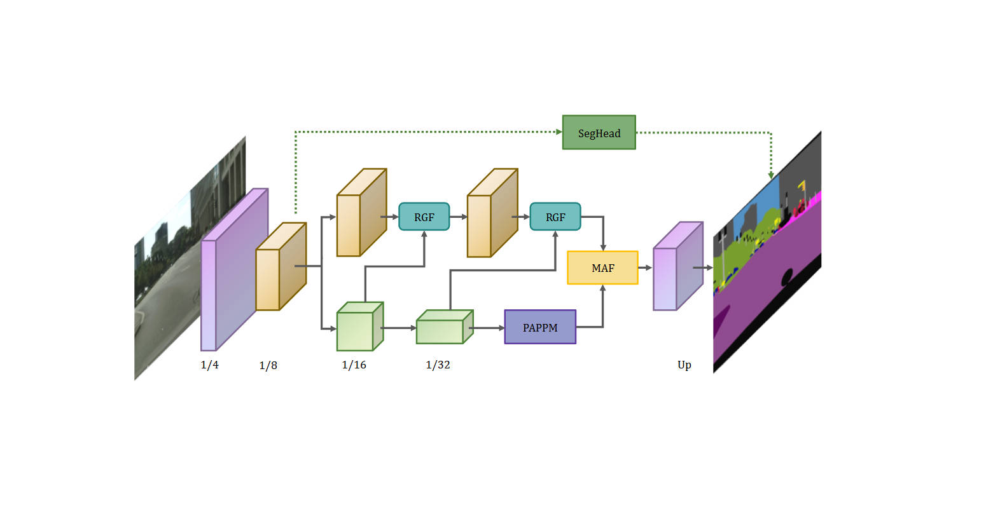
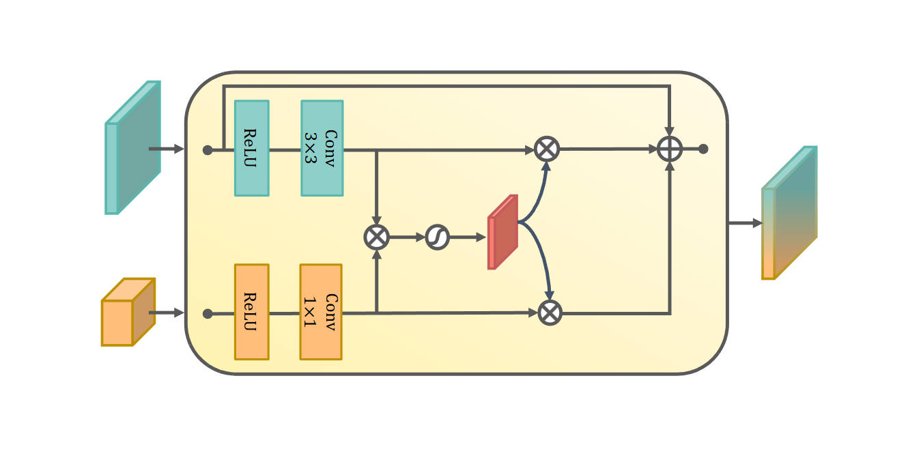
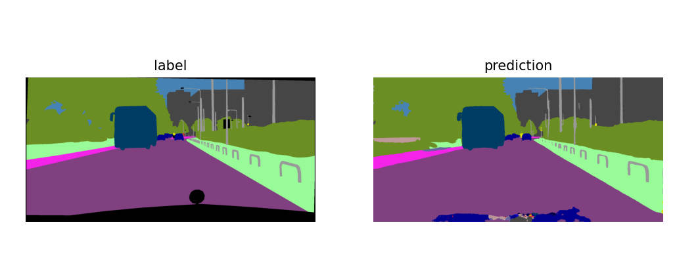

# DSGNet

深度语义引导多尺度注意力融合网络

## 概述

整体架构预览



模块细节



在自动驾驶数据集上的效果对比图



## 数据集准备

Cityscapes：[Cityscapes官方下载](https://www.cityscapes-dataset.com/downloads/)

CamVid：[Camvid11分类数据集（原图，标签，掩码）](https://featurize.cn/datasets/chris2000520)

数据集文件结构如下

```py
/Cityscapes
    /gtFine
    /leftImg8bit
```

```python
/CamVid
	/train
    /trainannot
    /val
    /valannot
    /test
    /testannot
```

## 使用方法

我们对设计的模型分别在两个自动驾驶数据集上进行训练，为了方便，代码分别放在两个文件夹中。文件夹结构是相同的，参数设置在`my_config`和`base_config`中。**注意前者会覆盖后者的设置，为了代码正常运行，请仔细检查参数！**

使用以下命令即可运行

```py
python main.py
```

### 模型参数

```python
python ./tools/get_model_infos.py
```

### 速度测试

```py
python ./tools/test_speed.py
```

## 对比实验

| Year |     Model      |   MIoU   |   FPS   |    GPU     | Resolution |  Params  |
| :--: | :------------: | :------: | :-----: | :--------: | :--------: | :------: |
| 2016 |      ENet      |    57    |  71.9   |    3090    | 1024 2048  | **0.4M** |
| 2017 |     ICNet      |   69.5   |   30    |  TitanX M  | 1024 2048  |  26.5M   |
| 2018 | BiSeNet(Res18) |   74.7   |  55.6   |    3090    | 1024 2048  |   49M    |
| 2019 |     DFANet     |   71.3   |  42.2   |    3090    | 1024 2048  |   7.8M   |
| 2020 |   BiSeNetV2    |   72.6   |  82.6   |    3090    | 1024 2048  |   2.3M   |
| 2020 |     FANet      |   74.4   |  50.6   |    3090    | 1024 2048  |  12.3M   |
| 2020 |     SFNet      |   74.5   |   74    | GTX 1080Ti | 1024 2048  |  9.03M   |
| 2021 |     CFPNet     |   70.1   |   50    |    3090    | 1024 2048  |  0.55M   |
| 2021 |   Lite-HRNet   |   72.8   |   24    |    3090    | 1024 2048  |   1.1M   |
| 2022 |   PP-LiteSeg   |   74.9   | **148** |    3090    | 1024 2048  |  6.33M   |
| 2024 |    **Ours**    | **74.9** |  81.2   |    3090    | 1024 2048  |   3.4M   |

## 致谢

感谢[**zh230**](https://github.com/zh320)提供的源码[realtime-semantic-segmentation-pytorch](https://github.com/zh320/realtime-semantic-segmentation-pytorch)，今当远离，临表涕零，不知所言。
